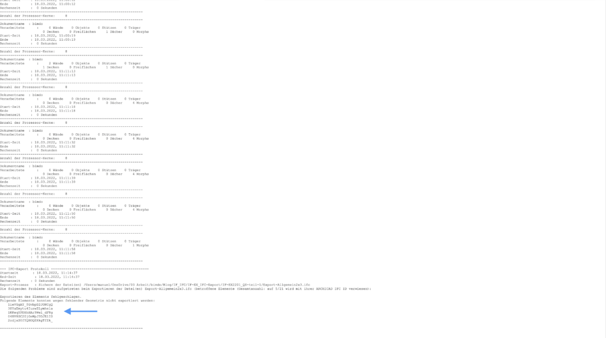

## Export
La scelta dello strumento giusto in ArchiCAD è cruciale per un export IFC di successo. Mentre gli strumenti standard come muri, solai e tetti lavorano con parametri chiaramente definiti per lunghezza, larghezza e altezza, lo strumento morph si comporta più come argilla digitale senza parametri fissi. Di seguito, dimostro come le diverse impostazioni degli strumenti influenzano l'export utilizzando cinque scatole di test. Anche se gli esempi sono specifici per ArchiCAD, illustrano un principio fondamentale: la scelta dello strumento di modellazione influenza direttamente la qualità dell'export.

### Messaggio di errore Archicad
I messaggi di errore durante l'export non devono essere semplicemente chiusi, ma esaminati attentamente. Anche quando forniscono poche informazioni, danno indizi importanti su possibili problemi. In questo caso, cinque elementi mancano dall'export - il motivo sono elementi con spessore 0 mm.

### Registro di export Archicad
Il registro di export fornisce una visione dettagliata del processo di export. Oltre ai tempi di calcolo per i singoli passaggi del processo, mostra anche potenziali problemi come geometrie corrotte o GUID duplicati - e questo anche senza eseguire un export IFC.

Nel nostro ultimo export, sono stati identificati problemi con 5 dei 21 elementi. Questi sono elencati nella parte inferiore del registro con i loro GUID unici. Con queste informazioni, possiamo ora cercare specificamente gli elementi interessati e correggere le cause.

La ricerca manuale di elementi problematici richiede tempo, ecco perché è importante una modellazione pulita fin dall'inizio. Con lo strumento "Trova e seleziona" di ArchiCAD, gli elementi interessati possono essere trovati rapidamente tramite il loro GUID. Funzioni di ricerca simili sono disponibili nella maggior parte dei visualizzatori IFC.

Né il Traduttore IFC Generale 2x3 né lo Schema IFC 4 in ArchiCAD 25 possono esportare gli elementi contrassegnati. La soluzione risiede nelle impostazioni del traduttore: con "Export geometria esatta" attivato, l'export funziona senza messaggi di errore. Ma attenzione - questa impostazione ha anche altri effetti.

## Ispezione Visiva
### Controllo della geometria Archicad
L'ispezione visiva è essenziale, specialmente per modelli parziali ed export strutturali. I seguenti elementi sono particolarmente soggetti a errori e dovrebbero essere controllati attentamente:

- Aperture (finestre, porte)
- Comandi solidi (pendenze)
- Intersezioni (angoli dei muri, transizioni di piano)
- Filtro di ristrutturazione
- Offset degli strati

Una modellazione 3D pulita è più importante della rappresentazione 2D. Gli elementi critici dovrebbero essere controllati all'inizio di un progetto, dopodiché sono sufficienti controlli a campione. I controlli precoci rendono possibile ottimizzare il flusso di lavoro del team attraverso preferiti, modelli e formazione.

### Piani
Per i piani, controllo sempre la loro designazione. Questi dovrebbero:
- Avere lo stesso numero di cifre (ad esempio, 08UG, 30OG invece di 8UG, 10OG)
- Essere numerati consecutivamente
- Avere sempre il numero davanti
- Non usare numeri negativi per i seminterrati (evitare -2UG)
- 

Questo è importante per un ordinamento corretto. Ecco alcuni esempi:

  

    <h4>Variante 1</h4>
    <table>
      <thead>
        <tr>
          <th>Non ordinato</th>
          <th>Ordinato</th>
        </tr>
      </thead>
      <tbody>
        <tr><td>AT04</td><td>AT04</td></tr>
        <tr><td>OG03</td><td>EG00</td></tr>
        <tr><td>OG02</td><td>OG01</td></tr>
        <tr><td>OG01</td><td>OG02</td></tr>
        <tr><td>EG00</td><td>OG03</td></tr>
        <tr><td>UG01</td><td>UG01</td></tr>
        <tr><td>UG02</td><td>UG02</td></tr>
      </tbody>
    </table>
  

  

    <h4>Variante 2</h4>
    <table>
      <thead>
        <tr>
          <th>Non ordinato</th>
          <th>Ordinato</th>
        </tr>
      </thead>
      <tbody>
        <tr><td>04AT</td><td>00EG</td></tr>
        <tr><td>03OG</td><td>01OG</td></tr>
        <tr><td>02OG</td><td>01UG</td></tr>
        <tr><td>01OG</td><td>02OG</td></tr>
        <tr><td>00EG</td><td>02UG</td></tr>
        <tr><td>01UG</td><td>03OG</td></tr>
        <tr><td>02UG</td><td>04AT</td></tr>
      </tbody>
    </table>
  

  

    <h4>Variante 3 (Raccomandata)</h4>
    <table>
      <thead>
        <tr>
          <th>Non ordinato</th>
          <th>Ordinato</th>
        </tr>
      </thead>
      <tbody>
        <tr><td>14AT</td><td>14AT</td></tr>
        <tr><td>13OG</td><td>13OG</td></tr>
        <tr><td>12OG</td><td>12OG</td></tr>
        <tr><td>11OG</td><td>11OG</td></tr>
        <tr><td>10EG</td><td>10EG</td></tr>
        <tr><td>09UG</td><td>09UG</td></tr>
        <tr><td>08UG</td><td>08UG</td></tr>
      </tbody>
    </table>
  

Raccomandazione: Iniziare la numerazione dal piano terra (ad esempio, 10EG). Questo permette:

- Espansione flessibile verso l'alto e verso il basso
- Numerazione logica (PT=10, 1° piano=11, 1° interrato=09)
- Ordinamento coerente in tutti i programmi

### Entità IFC
Il controllo delle entità IFC dovrebbe essere fatto sistematicamente:

1. Controllo a campione dei Property Sets (Psets):
    - Sono presenti tutti i Psets richiesti?
    - I Psets contengono le informazioni corrette?
    - Informazioni come "portante" sono state correttamente trasferite al campo standard?

2. Controllo in diversi visualizzatori IFC:
    - I file IFC possono essere interpretati diversamente in visualizzatori diversi
    - Problemi possono verificarsi specialmente con entità IFC non standard
    - La fonte dell'errore non è sempre nell'export stesso

3. Proprietà standard:
    - Proprietà importanti come "portante/non portante" devono essere nei campi standard definiti
    - Solo così le routine di controllo automatizzate funzioneranno in modo affidabile

### Metodi di test efficienti

   BIMCollab Zoom:

   - SmartViews permette di filtrare e colorare i contenuti del modello
   - Paragonabile alle sostituzioni grafiche in ArchiCAD
   - Esempio: Colorazione automatica delle finestre per numero di tipo
   - Permette un controllo visivo rapido dei tipi e della loro assegnazione

   Solibri:

   - Offre ampie opzioni di valutazione
   - Esempio: Raggruppamento e colorazione dei pannelli di facciata per dimensione
   - Migliora la comprensione delle informazioni del modello attraverso la rappresentazione visiva
   - Supporta l'ottimizzazione del modello

## Test basato sui dati
### Excel
Excel offre modi efficienti per controllare convenzioni e duplicati senza richiedere software di test speciali:

- Sotto "Dati" > "Convalida dati", è possibile creare semplici regole di validazione
- Le tabelle possono essere esportate da BIMCollab Zoom come CSV e analizzate in Excel
- Dopo le modifiche, il file Excel può essere reimportato in ArchiCAD

Esempi di controlli:

- Colonna 1: Validazione delle convenzioni di denominazione
- Colonna 2: Grafico a barre per visualizzare le larghezze dei telai
- Colonna 3: Categorizzazione con codice colore delle altezze dei telai

### PowerBI
PowerBI offre ampie possibilità di analisi e visualizzazione dei dati. Con dashboard interattive, le dipendenze dei dati possono essere visualizzate chiaramente, offrendo una nuova prospettiva sulle informazioni del modello. Molti strumenti hanno interfacce PowerBI dirette. In alternativa, possono essere utilizzate esportazioni CSV, che aggiornano automaticamente la dashboard quando vengono salvate costantemente sotto lo stesso percorso.

Un esempio pratico: Unendo circa 50 file IFC da diverse fasi del progetto in un modello ed esportandoli come elenco di componenti CSV, i cambiamenti come le variazioni di volume tra le fasi del progetto possono essere confrontati e analizzati in modo efficiente. Ciò consente una documentazione trasparente dello sviluppo del progetto e dichiarazioni quantificabili sui cambiamenti nelle diverse fasi del progetto.

---
**Pubblicato il:** {{ page.meta.date }} | **Codice:** {{ page.file.name[:10] }}  | **Autore:** {{ page.meta.author }}

**Tag:** {{ page.meta.tags | join(', ') }}  | **Originale:** {{ page.meta.original }}